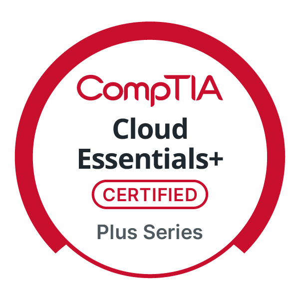

  

<h1 align="center">Hello &nbsp; , I'm Kenan Gain</h1>

  Content Creator | Gamer | Tech Enthusiast

  <h2>🌐 Connect with Me</h2>
  
Discover my work and connect on these platforms!

 | Kenan Gain | YouTube | Instagram | LinkedIn | Facebook |
| --- | --- | --- | --- | --- |
|  |  |  |  |  |

| Twitch | Twitter | Reddit | Discord | GitHub |
| --- | --- | --- | --- | --- |
|  |  |  |  |  |

 

  

<h2 align="center">🚀 About Me</h2>

As a versatile Computer Engineer and Full-Stack Developer, I specialize in Cloud Computing, Artificial Intelligence/Machine Learning, and high-quality streaming technologies. With a proven track record of driving innovation, I am committed to leveraging advanced AI solutions to boost productivity and foster creative problem-solving in technology. My passion for pushing the boundaries of modern technology equips me to deliver exceptional results in complex and dynamic environments.

 

<h2 align="center">🎓 My Multi-Cloud Certifications</h2>

<table>
  <tr>
    <!-- Icon Row -->
    <td align="center">
      
    </td>
    <td align="center">
      
    </td>
    <td align="center">
      
    </td>
    <td align="center">
      
    </td>
  </tr>
  <tr>
    <!-- Text Row -->
    <td align="center">
      🗓️ July 2025  
      🔗 <a href="https://www.credly.com/badges/39dc7ebd-4c71-4b7b-87a2-d2522dbd24fd/public_url">Credential</a> 
      <em>Validates AWS Cloud concepts, billing, and infrastructure.</em>
    </td>
    <td align="center">
      🗓️ July 2025  
      🔗 <a href="https://www.credly.com/badges/9bf9fc83-69c6-4d69-8230-49b0cf51a22b/public_url">Credential</a> 
      <em>Covers Azure services, governance, and pricing models.</em>
    </td>
    <td align="center">
      🗓️ July 2025  
      🔗 <a href="https://www.credly.com/badges/47d30a2e-4695-4a34-ae8e-46739c3bcd27/public_url">Credential</a> 
      <em>Tests GCP product knowledge, AI/ML, and business use cases.</em>
    </td>
    <td align="center">
      🗓️ July 2025  
      🔗 <a href="https://www.credly.com/badges/4bdc18df-6310-4d56-b4c7-3a2a9b8afdb6/public_url">Credential</a> 
      <em>Provides vendor-neutral cloud knowledge (governance & adoption).</em>
    </td>
  </tr>
</table>

  
<strong>🯠Why Multi-Cloud Solutions Matter + 📈 Upcoming Certification Roadmap (Click to Expand)</strong>

 

## 🎯 Why Multi-Cloud Solutions Matter

In today’s rapidly evolving technology landscape, organizations require **cloud strategies that are flexible, scalable, and resilient**.  
My certifications across **AWS**, **Azure**, **Google Cloud**, and **CompTIA** enable me to design and deliver solutions that are:

✅ **Vendor-Agnostic** – Minimize vendor lock-in and maximize flexibility  
✅ **Performance-Optimized** – Leverage best-in-class services across AWS, Azure, and GCP  
✅ **Highly Resilient** – Improve business continuity and disaster recovery capabilities  
✅ **AI/ML & Data-Centric** – Deploy, manage, and scale AI/ML workloads and data solutions effectively  
✅ **Governance-Driven** – Implement governance, security, and compliance best practices using a vendor-neutral cloud strategy  

> _“Mastering the Cloud… Across All Platforms.”_ ☁️🌎

## 📈 Upcoming Certification Roadmap

To further strengthen my cloud expertise and advance towards **architect-level and specialist roles**, I’m actively preparing for the following certifications:

| **Certification Goal** | **Focus Area** |
|:---|:---|
| **AWS Solutions Architect – Associate** | Cloud architecture design, deployment strategies, and fault tolerance |
| **Microsoft Azure Administrator – Associate** | Resource management, security, networking, and identity services in Azure |
| **Google Associate Cloud Engineer** | GCP workload deployment, monitoring, and management |
| **HashiCorp Terraform Associate / KCNA** | Infrastructure as Code (IaC), automation, and Kubernetes cluster management |
| **Cloud Security & DevOps Specializations** | Automation, CI/CD pipelines, container orchestration, and security governance |

---

✅ **Objective:**  
**To become a Multi-Cloud Architect and DevOps/AI Cloud Specialist**, delivering solutions that drive business value while ensuring scalability, reliability, and security.

 

<h3 align="center">Git Stats</h3>

 
  
   
   
 

<table>
  <tr>
    <td>
      
    </td>
    <td>
      
    </td>
    <td>
      
    </td>
  </tr>
</table>

### Top Repositories

  <table>
    <tr>
      <td>
        
      </td>
      <td>
        
      </td>
    </tr>
    <tr>
      <td>
        
      </td>
      <td>
        
      </td>
    </tr>
    <tr>
      <td>
        
      </td>
      <td>
        
      </td>
    </tr>
  </table>

### GitHub Contribution Chart

  

    &nbsp;&nbsp;Git Stats Summary&nbsp;&nbsp;
  

  
  
      
      

 

### KenanGain/README.md activity

  
&nbsp;&nbsp;GitHub Star History for KenanGain&nbsp;&nbsp;

  <h2>Star History Chart</h2>
  

 

  
🆠GitHub Profile Trophy

   
    
  

 

# Videos & Documentries

      

        <a href="https://www.linkedin.com/feed/update/urn:li:activity:7290621709374676994/">𝐁𝐞𝐬𝐭 𝐏𝐫𝐨𝐣𝐞𝐜𝐭 𝐒𝐡𝐨𝐰𝐜𝐚𝐬𝐞 𝐨𝐧 𝐋𝐢𝐧𝐤𝐞𝐝𝐈𝐧 EVER...</a>
      

 

 

# Multiple Pathways to Innovation: Explore My SaaS Products

 
 

## 🍁 MapleLawAI: Your Comprehensive Legal Companion

<a href="https://maplelawai.com">View Demo</a>

<table>
  <tr>
    <td>
      
    </td>
    <td>
      
    </td>
  </tr>
  <tr>
    <td colspan="2">
      
<strong>Welcome to 🍁 <a href="https://maplelawai.com">MapleLawAI</a>,</strong> your all-in-one AI-powered legal tool designed to support Canadian citizens, lawyers, immigrants, law students, and small businesses. Imagine a world where legal barriers no longer exist—where access to legal knowledge and services is a right for every Canadian, regardless of their background or financial standing. This is not merely a vision; it is the reality 🍁MapleLawAI is creating.

      
🍁<strong>MapleLawAI</strong> is an avant-garde platform set to revolutionize the legal sector in Canada. Developed for both clients and legal professionals, this platform stands as a beacon of innovation, efficiency, and accessibility. By leveraging the most advanced Large Language Models (LLMs) and a comprehensive vector database containing all Canadian legal documents, MapleLawAI ensures access to the most accurate and up-to-date legal information.

      
The Next.js application, styled with ShadCN Tailwind CSS, offers a seamless and intuitive user experience. Integrated with Clerk for secure authentication and powered by the Vercel AI SDK with edge runtime capabilities, MapleLawAI delivers swift AI responses and reliable performance. Whether researching case law, preparing for court, or seeking legal advice, MapleLawAI serves as a trusted partner.

      
The development does not stop here. MapleLawAI is continually evolving with future features such as a virtual courthouse, where arguments can be presented and a virtual judge delivers justice. The platform will also analyze case law to provide statistics and insightful answers, complemented by comprehensive dashboards and a robust research platform. Additionally, there are plans to expand globally with specialized legal AI tools including Egale Legal AI for the USA, JusticeMate AI for Australia, RedBusLaw AI for the UK, MaoriJusticeAI for New Zealand, and FrankfurtLegalBot for Germany.

    </td>
  </tr>
</table>

  
<strong>Features and Highlights</strong>

  <table>
    <tr>
      <th>Upcoming Features</th>
      <th>Current Features</th>
    </tr>
    <tr>
      <td valign="top">
        <ul>
          <li><strong>Virtual Courthouse</strong>: Present and argue cases in a fully virtual environment with a virtual judge.</li>
          <li><strong>Comprehensive Case Analysis</strong>: Access detailed statistics and insights from extensive case law data.</li>
          <li><strong>Global Expansion</strong>: Introducing specialized legal AI tools for the USA, Australia, UK, New Zealand, and Germany.</li>
          <li><strong>Enhanced Dashboards</strong>: Advanced dashboards for better data visualization and decision-making.</li>
          <li><strong>Research Platform</strong>: A dedicated platform for in-depth legal research and analysis.</li>
        </ul>
      </td>
      <td valign="top">
        <ul>
          <li><strong>Best LLM Models Available</strong>: Utilizes the most advanced language models for accurate legal assistance.</li>
          <li><strong>Comprehensive Vector Database</strong>: Access to a vast repository of Canadian legal documents and resources.</li>
          <li><strong>Secure Authentication</strong>: Integrated with Clerk to ensure reliable and secure user access.</li>
          <li><strong>Next.js Application</strong>: A robust and scalable web application framework for optimal performance.</li>
          <li><strong>ShadCN Tailwind CSS</strong>: Stylish and responsive design for an excellent user experience.</li>
          <li><strong>Vercel AI SDK & Edge Runtime</strong>: Delivers fast AI responses and efficient processing.</li>
          <li><strong>Continuous Updates</strong>: Regular enhancements and feature additions to keep the platform cutting-edge.</li>
        </ul>
      </td>
    </tr>
    <tr>
      <td colspan="2">
        <strong>Quick Start:</strong> Visit <a href="https://maplelawai.com">MapleLawAI</a> today to revolutionize your legal interactions. Whether seeking legal advice, conducting research, or managing a legal practice, MapleLawAI provides the necessary tools and knowledge.
      </td>
    </tr>
  </table>

 

## Document Whispers: AI Answers, Knowledge Revealed
<a href="https://documentwhispers.com">View Demo</a>
<table>
  <tr>
    <td>
      
    </td>
    <td>
      
    </td>
  </tr>
  <tr>
    <td colspan="2">
      
<strong>Welcome to 'Document Whispers',</strong> the future of document interaction. This modern web application transforms how you engage with your PDFs by allowing you to upload documents and chat directly with them. Powered by the cutting-edge Vercel AI SDK, 'Document Whispers' provides blazing-fast AI responses, making it your go-to tool for quick answers to assignments and research inquiries.

      
Our platform not only lets you read documents as you interact with them, but also ensures that your queries are thoroughly analyzed to provide high-quality, well-researched answers. Leveraging the largest and most advanced language models, our generative AI digs deep into your questions, offering precise and insightful responses.

      
Built on robust serverless technology for seamless performance and protected by Clerk for top-tier authentication, 'Document Whispers' is continually evolving. Stay tuned for more innovative features that will redefine your document handling experience!

    </td>
  </tr>
</table>

  
<strong>Features and Highlights</strong>

  <table>
    <tr>
      <th>Upcoming Features</th>
      <th>Features</th>
    </tr>
    <tr>
      <td valign="top">
        <ul>
          <li><strong>Multilingual Support</strong>: To help users worldwide engage with their documents.</li>
          <li><strong>Mobile Application</strong>: Access Document Whispers on the go with our upcoming mobile app.</li>
          <li><strong>Enhanced Security Measures</strong>: Additional layers of security to protect your sensitive information.</li>
        </ul>
      </td>
      <td valign="top">
        <ul>
          <li><strong>AI-Powered Interaction</strong>: Engage with your documents through natural language conversations.</li>
          <li><strong>Real-Time Processing</strong>: Upload and start conversing with your documents without any delay.</li>
          <li><strong>Advanced Query Understanding</strong>: Utilizes the latest in AI technology to comprehend and respond to inquiries accurately.</li>
          <li><strong>Serverless Architecture</strong>: Ensures high availability and scalability without the hassle of infrastructure management.</li>
          <li><strong>Secure Authentication</strong>: Integrates with Clerk to provide reliable and secure access to the platform.</li>
          <li><strong>Continuous Updates</strong>: Regular updates to add new features and enhance the user experience.</li>
        </ul>
      </td>
    </tr>
    <tr>
      <td colspan="2">
        <strong>Quick Start:</strong> Visit <a href="https://documentwhispers.com">Document Whispers</a> to start transforming your PDF interactions today. Explore the possibilities of engaging with your documents in a way you never thought possible.
      </td>
    </tr>
  </table>

# Coming soon

 

<h2>🚀 Super GPT: The AI Overachiever You Didn’t Know You Needed</h2>

<strong>Super GPT</strong> is here to unite the world’s top LLMs, because why settle for one when you can have them all? Currently in development, this powerhouse is over-prepared to handle web searches, document interrogation, and even video analysis. If you need something found, explained, or overanalyzed, Super GPT has you covered.

Mixing small and large language models like a tech smoothie, Super GPT doesn’t just answer questions; it contemplates existence. With a sleek UI that practically <em>whispers</em> “futuristic,†Super GPT is setting a gold standard in AI that we’re almost certain no one actually asked for—but everyone will soon need.

<h2>🔍 Ultimate AI Search Engine: For When You Want Answers, Not Opinions</h2>

Enter the <strong>Ultimate AI Search Engine</strong>—because good enough is simply unacceptable. This ambitious project aims to put SearchGPT to shame, pulling in multiple LLMs for a layered, context-savvy search experience that adjusts to your wildest curiosities.

Built to do more than just “find stuff,†the Ultimate AI Search Engine promises to dive headfirst into the internet's abyss and return with gems of wisdom. From web, document, and knowledge retrieval, it’s your go-to for precise answers and the kind of search results that will leave you wondering how you ever managed without it.

 

## 🏆 Featured Projects

<table>
  <tr>
    <td align="center" width="300" height="200">
      
       
      <strong>Sara AI for Canadian Tire</strong>
       
      AI-enhanced shopping experience
    </td>
    <td align="center" width="300" height="200">
      
       
      <strong>Weather-3D-AI App</strong>
       
      Modern design with shadcn UI, AI integration, Wikipedia, and local news widgets
    </td>
    <td align="center" width="300" height="200">
      
       
      <strong>Fast-Gemini-Nano</strong>
       
      Local LLM Chrome AI – extremely fast, still in development but highly promising
    </td>
  </tr>
  <tr>
    <td align="center" width="300" height="200">
      
       
      <strong>AI-Powered Content Creation</strong>
       
      Automated content generation using various LLMs
    </td>
    <td align="center" width="300" height="200">
      
       
      <strong>MapleLaw AI</strong>
       
      Legal information assistant for Canadian citizens
    </td>
    <td align="center" width="300" height="200">
      
       
      <strong>4K60 Streaming Setup</strong>
       
      High-performance streaming with instant replay
    </td>
  </tr>
  <tr>
    <td align="center" width="300" height="200">
      
       
      <strong>Cloud-Native Web Apps</strong>
       
      Next.js, React, Django with Docker & Kubernetes
    </td>
    <td align="center" width="300" height="200">
      
       
      <strong>Next Project?</strong>
       
      Let's collaborate on something amazing!
    </td>
  </tr>
</table>

 

  <h2 align="center" style="display: inline-flex; align-items: baseline;">
    Socials Stats 
  </h2>

  

    
    <h3>
     <a href="https://www.instagram.com/knightgamer87/" target="_blank" style="color: #e4405f; text-decoration: none; font-weight: bold;">
  Follow Me on Instagram
</a>
    </h3>
  

  <table>
    <tr>
      <td align="center" style="border: none;">
        

          
          
        

      </td>
    </tr>
  </table>
  

  <h3>
    <a href="https://discord.gg/YdDyV6QqEN">
      Join Our Discord Community
    </a>
  </h3>

<table>
  <tr>
    <!-- Discord Widget Column -->
    <td align="center" style="border: none;">
      
    </td>
    <!-- Discord Banner Column -->
    <td align="center" style="border: none;">
      
    </td>
    <!-- Discord Presence Column -->
    <td align="center" style="border: none;">
      
    </td>
  </tr>
</table>

<h3 align="center">YouTube Stats</h3>

<h3 align="center">Leetcode Stats</h3>

  

<h3 align="center">Steam Profile</h3>

  

<h3 align="center">Latest Dev.to</h3>

 

<table>
  <tr>
    <!-- Dev Profile Header -->
    <th align="center">
      Dev Profile
    </th>
    <!-- roadmap.sh Profile Header -->
    <th align="center">
      roadmap.sh Profile
    </th>
  </tr>
  <tr>
    <!-- Dev Profile -->
    <td align="center">
     
    </td>
    <!-- roadmap.sh Profile -->
    <td align="center">
         
    </td>
  </tr>
</table>

<h3 align="center">Stardev.io</h3>

<h3 align="center">Stack overflow</h3>

<table>
  <tr>
    <th colspan="2">Stack Overflow</th>
  </tr>
  <tr>
    <td>
      
    </td>
    <td>
      
    </td>
  </tr>
</table>

<h1 align="center"> Tech Stack</h1>

<h3 align="center">Web Development</h3>

<table style="background-color: black; color: white; border: none; border-radius: 15px; overflow: hidden;">
  <thead>
    <tr>
      <th colspan="8" align="center" style="color: white;">Frontend</th>
    </tr>
  </thead>
  <tbody>
    <tr>
      <td align="center" style="border: none;">
        
         Next.js
      </td>
      <td align="center" style="border: none;">
        
         Tailwind CSS
      </td>
      <td align="center" style="border: none;">
        
         React
      </td>
      <td align="center" style="border: none;">
        
         TypeScript
      </td>
      <td align="center" style="border: none;">
        
         JavaScript
      </td>
      <td align="center" style="border: none;">
        
         jQuery
      </td>
      <td align="center" style="border: none;">
        
         HTML
      </td>
      <td align="center" style="border: none;">
        
         CSS
      </td>
    </tr>
  </tbody>
</table>

<table style="background-color: black; color: white; border: none; border-radius: 15px; overflow: hidden;">
  <thead>
    <tr>
      <th colspan="4" align="center" style="color: white;">Backend</th>
    </tr>
  </thead>
  <tbody>
    <tr>
      <td align="center" style="border: none;">
         Node.js
      </td>
      <td align="center" style="border: none;">
         Django
      </td>
      <td align="center" style="border: none;">
         Flask
      </td>
      <td align="center" style="border: none;">
         Express
      </td>
    </tr>
  </tbody>
</table>

<table style="background-color: black; color: white; border: none; border-radius: 15px; overflow: hidden;">
  <thead>
    <tr>
      <th colspan="4" align="center" style="color: white;">Database</th>
    </tr>
  </thead>
  <tbody>
    <tr>
      <td align="center" style="border: none;">
         MySQL
      </td>
      <td align="center" style="border: none;">
         MongoDB
      </td>
      <td align="center" style="border: none;">
         PostgreSQL
      </td>
      <td align="center" style="border: none;">
         Neo4j
      </td>
    </tr>
  </tbody>
</table>

<h3 align="center">Cloud Computing & DevOps</h3>

<table style="background-color: black; color: white; border: none; border-radius: 15px; overflow: hidden;">
  <thead>
    <tr>
      <th colspan="4" align="center" style="color: white;">Containerization & Orchestration</th>
    </tr>
  </thead>
  <tbody>
    <tr>
      <td align="center" style="border: none;">
         Docker
      </td>
      <td align="center" style="border: none;">
         Kubernetes
      </td>
      <td align="center" style="border: none;">
         Helm
      </td>
      <td align="center" style="border: none;">
         Skaffold
      </td>
    </tr>
  </tbody>
</table>

<table style="background-color: black; color: white; border: none; border-radius: 15px; overflow: hidden;">
  <thead>
    <tr>
      <th colspan="3" align="center" style="color: white;">Cloud Providers</th>
    </tr>
  </thead>
  <tbody>
    <tr>
      <td align="center" style="border: none;">
         Azure
      </td>
      <td align="center" style="border: none;">
         GCP
      </td>
      <td align="center" style="border: none;">
         AWS
      </td>
    </tr>
  </tbody>
</table>

<table style="background-color: black; color: white; border: none; border-radius: 15px; overflow: hidden;">
  <thead>
    <tr>
      <th colspan="2" align="center" style="color: white;">Infrastructure as Code</th>
    </tr>
  </thead>
  <tbody>
    <tr>
      <td align="center" style="border: none;">
         Terraform
      </td>
        <td align="center" style="border: none;">
         Ansible
       </td>
    </tr>
  </tbody>
</table>

<h3 align="center">AI/ML & Data Science</h3>

  <table style="background-color: black; color: white; border: none; border-radius: 15px; overflow: hidden;">
  <thead>
    <tr>
      <th colspan="5" align="center" style="color: white;">Languages & Libraries</th>
    </tr>
  </thead>
  <tbody>
    <tr>
      <td align="center" style="border: none;">
         Python
      </td>
      <td align="center" style="border: none;">
         NumPy
      </td>
      <td align="center" style="border: none;">
         Pandas
      </td>
      <td align="center" style="border: none;">
<!--          -->
         TensorFlow
      </td>
      <td align="center" style="border: none;">
         PyTorch
      </td>
    </tr>
  </tbody>
 </table>

<table style="background-color: black; color: white; border: none; border-radius: 15px; overflow: hidden;">
  <thead>
    <tr>
      <th colspan="3" align="center" style="color: white;">Frameworks & Tools</th>
    </tr>
  </thead>
  <tbody>
    <tr>
      <td align="center" style="border: none;">
         LangChain
      </td>
      <td align="center" style="border: none;">
         Ollama
      </td>
  <td align="center" style="border: none;">
         LlamaIndex
      </td>
    </tr>
  </tbody>
</table>

<h3 align="center"> AI Tools & Prompt Engineering</h3>

 <table style="background-color: black; color: white; border: none; border-radius: 15px; overflow: hidden;">
  <thead>
    <tr>
      <th colspan="6" align="center" style="color: white;">AI Tools</th>
    </tr>
  </thead>
  <tbody>
    <tr>
      <td align="center" style="border: none;">
         ChatGPT
      </td>
       <td align="center" style="border: none;">
         Claude (Anthropic)
      </td>
      <td align="center" style="border: none;">
<!--          -->
         Google Gemini
      </td>
      <td align="center" style="border: none;">
         Hugging Face
      </td>
      <td align="center" style="border: none;">
         Meta Llama
      </td>
      <td align="center" style="border: none;">
         Cohere
      </td>
    </tr>
  </tbody>
</table>

<h3 align="center">Streaming & Video Editing</h3>

<table style="background-color: black; color: white; border: none; border-radius: 15px; overflow: hidden;">
  <thead>
    <tr>
      <th colspan="2" align="center" style="color: white;">Streaming Platforms</th>
    </tr>
  </thead>
  <tbody>
    <tr>
      <td align="center" style="border: none;">
         Twitch
      </td>
      <td align="center" style="border: none;">
         YouTube
      </td>
    </tr>
  </tbody>
</table>

<table style="background-color: black; color: white; border: none; border-radius: 15px; overflow: hidden;">
  <thead>
    <tr>
      <th align="center" style="color: white;">Streaming Tools</th>
    </tr>
  </thead>
  <tbody>
    <tr>
      <td align="center" style="border: none;">
         OBS
      </td>
    </tr>
  </tbody>
</table>

  <table style="background-color: black; color: white; border: none; border-radius: 15px; overflow: hidden;">
    <thead>
      <tr>
        <!-- Update colspan to 4 if you're adding a fourth column -->
        <th colspan="4" align="center" style="color: white;">Video Editing Tools</th>
      </tr>
    </thead>
    <tbody>
      <tr>
        <td align="center" style="border: none;">
           Adobe Photoshop
        </td>
        <td align="center" style="border: none;">
           Adobe Premiere Pro
        </td>
        <td align="center" style="border: none;">
           Adobe After Effects
        </td>
        <!-- DaVinci Resolve icon from Wikipedia -->
        <td align="center" style="border: none;">
           DaVinci Resolve
        </td>
      </tr>
    </tbody>
  </table>

## 🎥 My YouTube Channel

### My Videos

<table>
  <tr>
    <td>
      
      
<a href="https://www.youtube.com/watch?v=cicZ6CvEpi0">Knight Gamer Setup 2.0</a>

    </td>
    <td>
      
      
<a href="https://www.youtube.com/watch?v=znd-OlyoNyQ">Bora Bora (Valorant Montage) | 1440p</a>

    </td>
    <td>
      
      
<a href="https://www.youtube.com/watch?v=CYP_E5epgEU">Lean on</a>

    </td>
  </tr>
  <tr>
    <td>
      
      
<a href="https://www.youtube.com/watch?v=1HN--BxRcb4">Epic Gameplay Montage</a>

    </td>
    <td>
      
      
<a href="https://www.youtube.com/watch?v=sdLwa-Ckri0">QHD 60FPS</a>

    </td>
    <td>
      
      
<a href="https://www.youtube.com/watch?v=5avcAkIMUWw">BGMI Frag Movie</a>

    </td>
  </tr>
</table>

 

### GIFs, Memes, and Jokes

GIFs, Memes, and Jokes

  <table>
    <tr>
      <td>
        
      </td>
      <td>
        
      </td>
    </tr>
    <tr>
      <td>
        
      </td>
      <td>
        
      </td>
    </tr>
    <tr>
      <td>
        
      </td>
      <td>
        
      </td>
    </tr>
  </table>

 

  
Wanna Play a Game?

  <h2 align="center">Enjoy the Game!</h2>
  
   

<h2 align="center">🎵 My Spotify Playlist</h2>

Explore my meticulously curated Spotify playlist, composed entirely of exceptional copyright-free music. It's perfectly suited for enhancing focus during coding sessions, fueling creativity, or simply unwinding. Each track has been selected to ensure an uninterrupted, high-quality audio experience.
<h5 align="center">Enjoy the tunes!</h5>

<h3 align="center">Top Artists of Playlist</h3>

  

  <table>
    <tr>
      <td>
        
      </td>
      <td>
        
      </td>
    </tr>
  </table>

  

    
View Data Card for Spotify

    
  

<h2 align="center">Support Me</h2>

  <table align="center">
    <tr>
      <th align="center">
        
      </th>
      <th align="center">
        
      </th>
      <th align="center">
        
      </th>
      <th align="center">
        
      </th>
    </tr>
    <tr>
      <td align="center">
        
      </td>
      <td align="center">
       
      </td>
      <td align="center">
        
      </td>
      <td align="center">
        
      </td>
    </tr>
  </table>

<h2 align="center">📫 Let's Connect!</h2>

<table align="center">
  <thead>
    <tr>
      <th>Email</th>
      <th>WhatsApp (Canada)</th>
      <th>WhatsApp (India)</th>
    </tr>
  </thead>
  <tbody>
    <tr>
      <td align="center">
        <a href="mailto:kenangain2910@gmail.com" target="_blank">
          
           
          kenangain2910@gmail.com
        </a>
      </td>
      <td align="center">
        <a href="https://wa.me/14374364786" target="_blank">
          
           
          +1-437-436-4786
        </a>
      </td>
      <td align="center">
        <a href="https://wa.me/918200280008" target="_blank">
          
           
          +91-820-028-0008
        </a>
      </td>
    </tr>
  </tbody>
</table>

 

<h3>

  
⭐️ From [KenanGain](https://github.com/KenanGain) | Let's innovate together! 

</h3>

